# Core API Reference / 核心API参考

## Architecture Overview / 架构概述

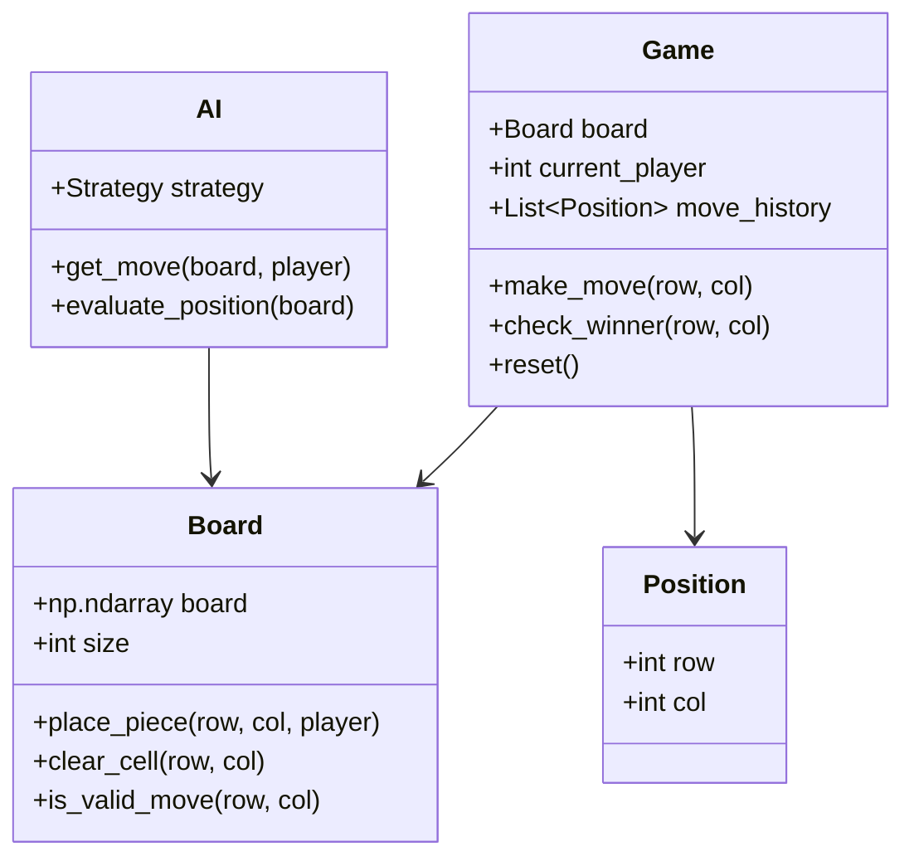

## Game Module / 游戏模块

### Board Class / 棋盘类

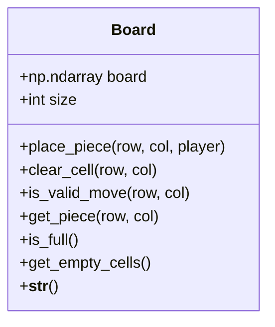

### Game Class / 游戏类

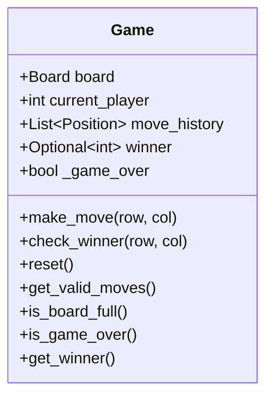

### Position Class / 位置类

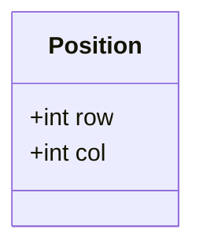

## AI Module / AI模块

### AI Engine / AI引擎

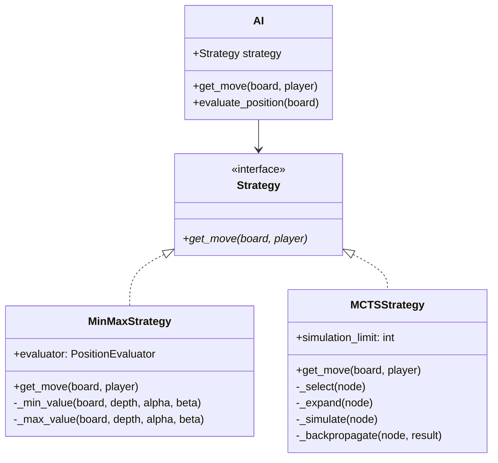

### Strategies / 策略

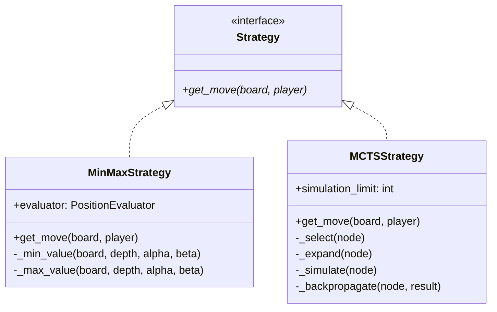

### Evaluation / 评估

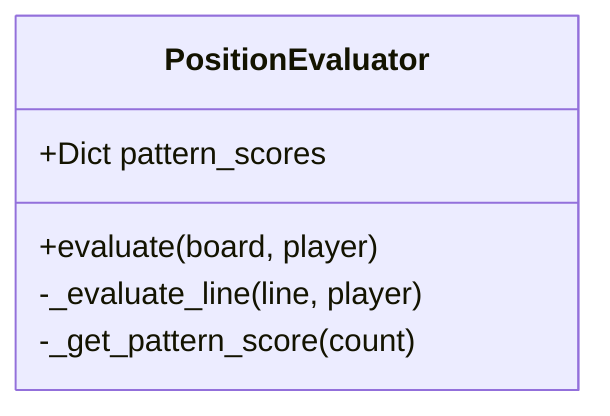

## Platform Module / 平台模块

### Platform Base / 平台基类

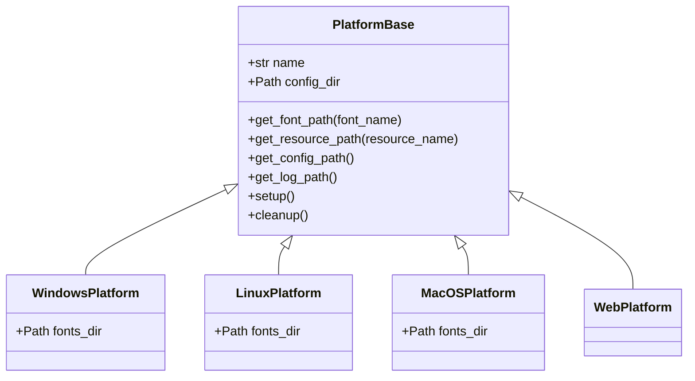

## Resource Module / 资源模块

### Resource Manager / 资源管理器

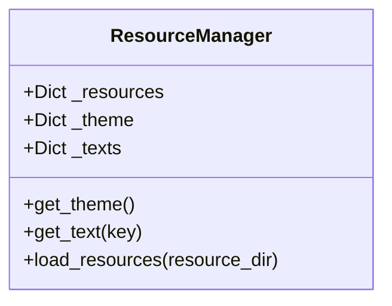

### Theme Manager / 主题管理器

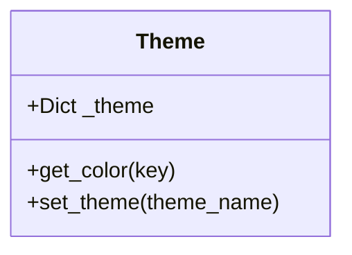

### I18n Manager / 国际化管理器

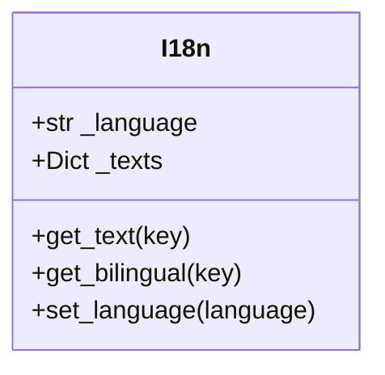