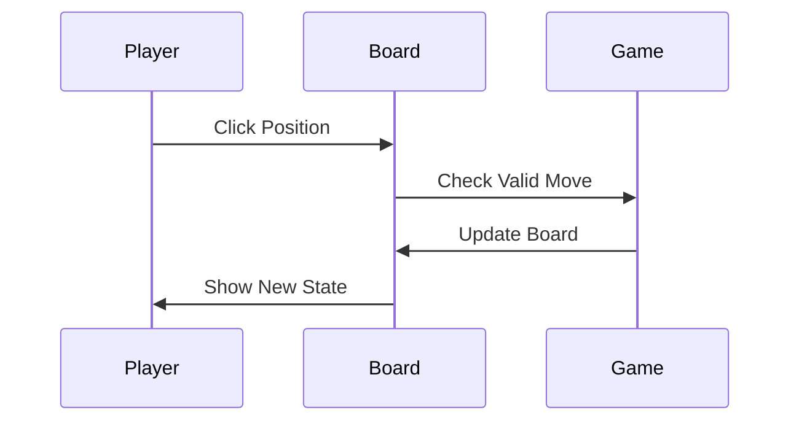
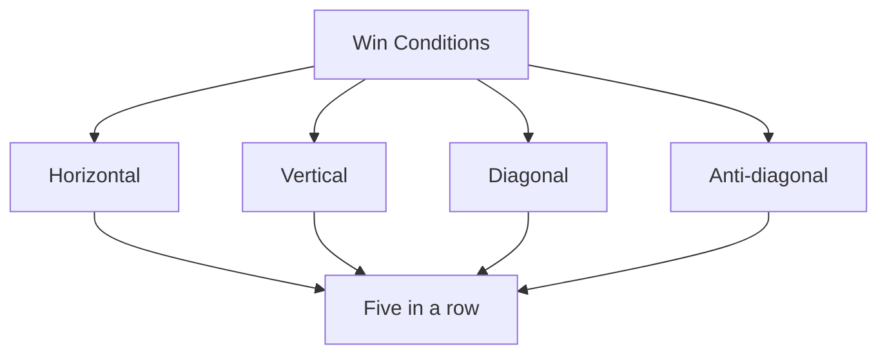
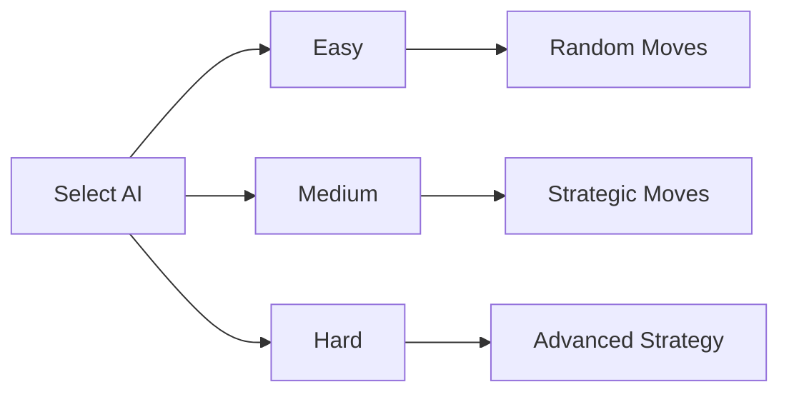
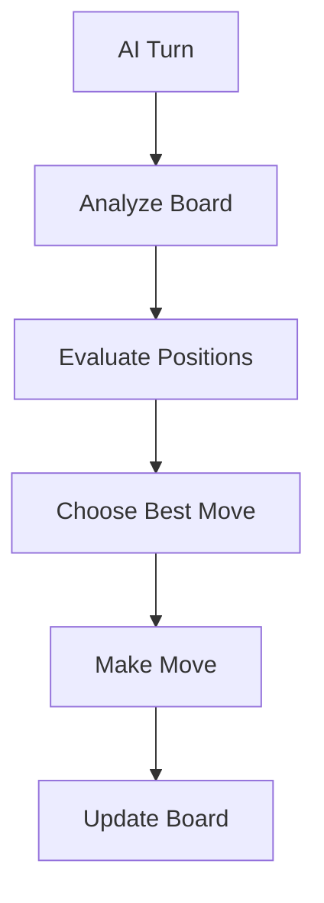
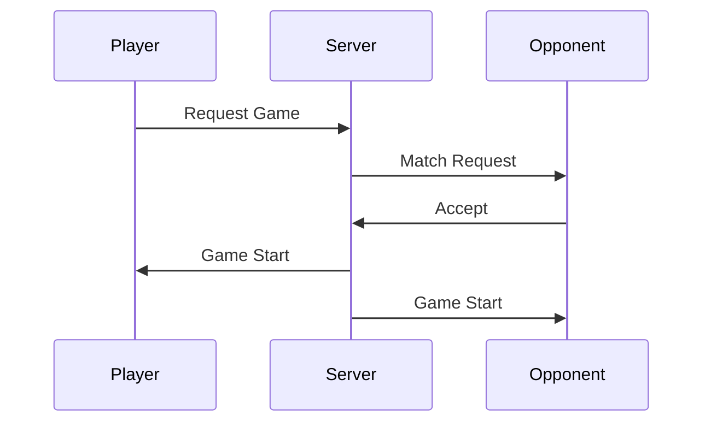
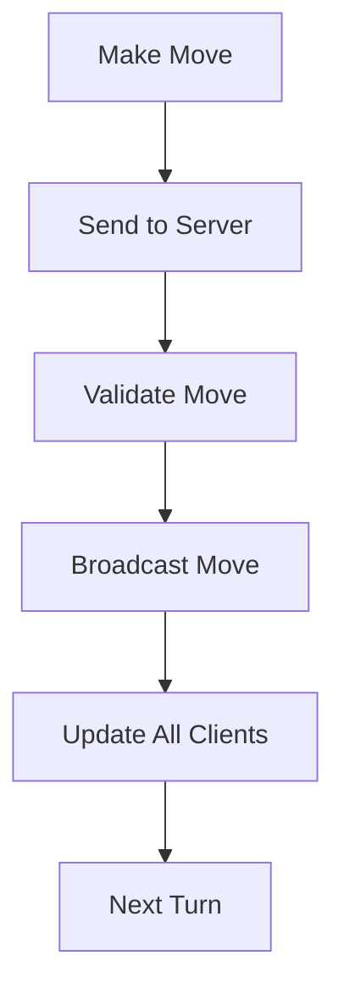
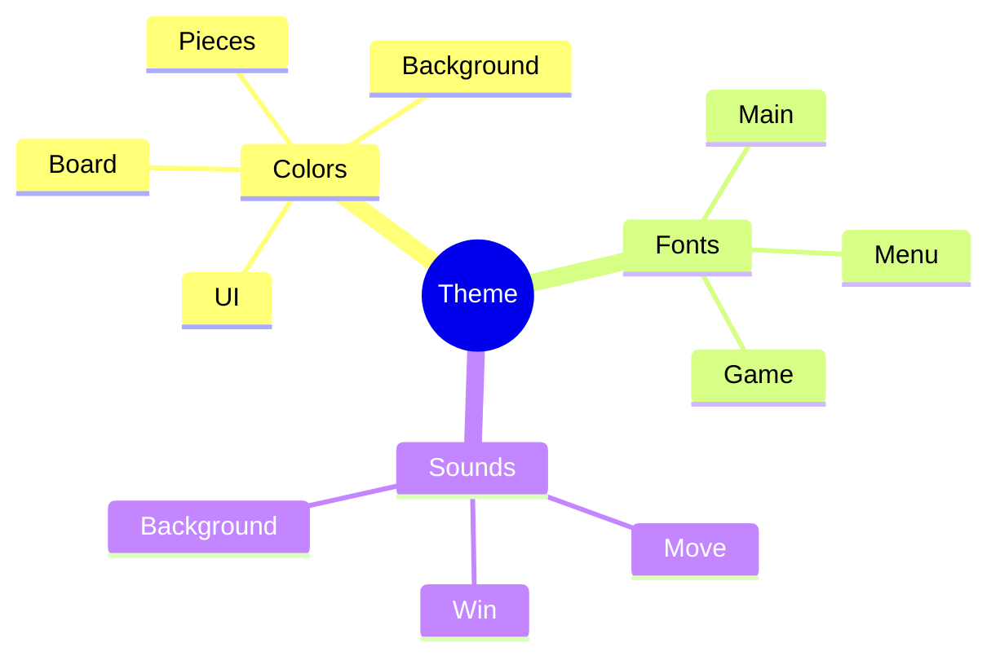
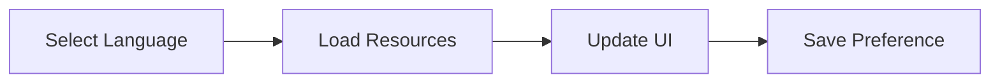
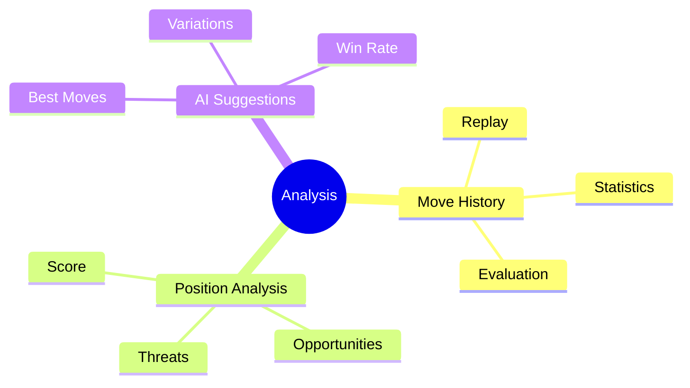
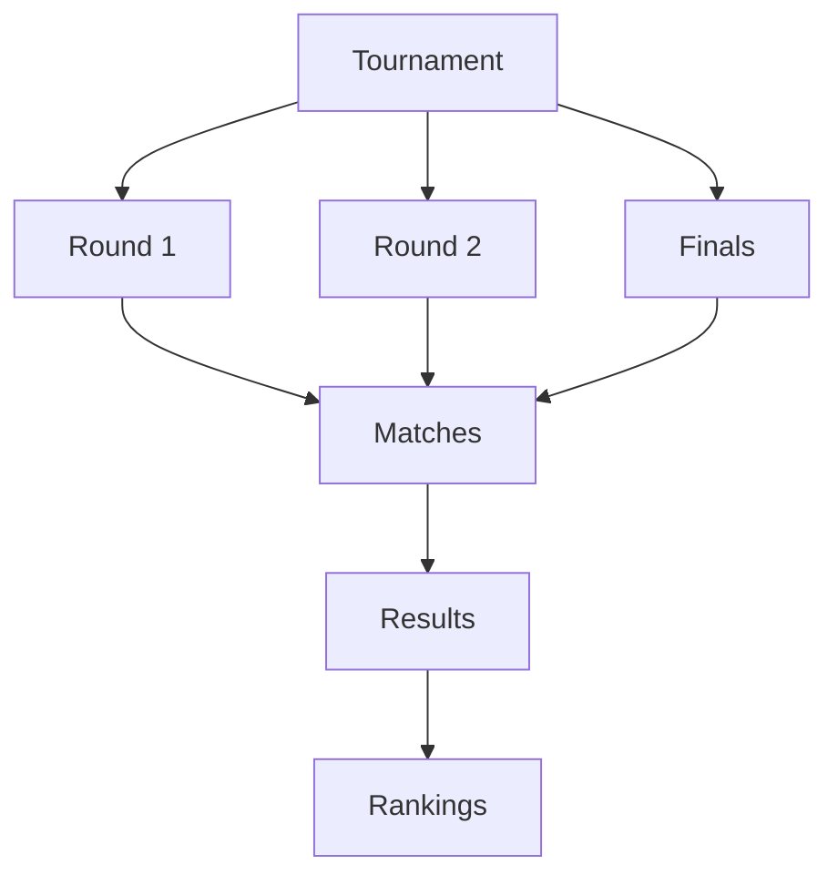

# Interactive Tutorial / 交互式教程

## Game Basics / 游戏基础

### Starting a Game / 开始游戏

<div class="tutorial-animation">
    <video width="600" height="400" controls>
        <source src="../images/tutorials/animations/start-game.mp4" type="video/mp4">
        Your browser does not support the video tag.
    </video>
</div>

1. Click "New Game" button / 点击"新游戏"按钮
2. Select game mode / 选择游戏模式
3. Configure settings / 配置设置
4. Start playing / 开始游戏

### Making Moves / 落子操作

<div class="tutorial-animation">
    <video width="600" height="400" controls>
        <source src="../images/tutorials/animations/making-moves.mp4" type="video/mp4">
        Your browser does not support the video tag.
    </video>
</div>



### Understanding Win Conditions / 理解胜利条件

<div class="tutorial-animation">
    <video width="600" height="400" controls>
        <source src="../images/tutorials/animations/win-conditions.mp4" type="video/mp4">
        Your browser does not support the video tag.
    </video>
</div>

Win patterns:


## Playing Against AI / 对战AI

### AI Difficulty Selection / AI难度选择

<div class="tutorial-animation">
    <video width="600" height="400" controls>
        <source src="../images/tutorials/animations/ai-selection.mp4" type="video/mp4">
        Your browser does not support the video tag.
    </video>
</div>



### Understanding AI Behavior / 理解AI行为

<div class="tutorial-animation">
    <video width="600" height="400" controls>
        <source src="../images/tutorials/animations/ai-behavior.mp4" type="video/mp4">
        Your browser does not support the video tag.
    </video>
</div>

AI decision process:


## Online Multiplayer / 在线多人游戏

### Joining a Game / 加入游戏

<div class="tutorial-animation">
    <video width="600" height="400" controls>
        <source src="../images/tutorials/animations/join-game.mp4" type="video/mp4">
        Your browser does not support the video tag.
    </video>
</div>



### Playing Online / 在线对战

<div class="tutorial-animation">
    <video width="600" height="400" controls>
        <source src="../images/tutorials/animations/online-play.mp4" type="video/mp4">
        Your browser does not support the video tag.
    </video>
</div>

Network game flow:


## Customization / 自定义设置

### Theme Customization / 主题自定义

<div class="tutorial-animation">
    <video width="600" height="400" controls>
        <source src="../images/tutorials/animations/theme-customization.mp4" type="video/mp4">
        Your browser does not support the video tag.
    </video>
</div>

Theme components:


### Language Settings / 语言设置

<div class="tutorial-animation">
    <video width="600" height="400" controls>
        <source src="../images/tutorials/animations/language-settings.mp4" type="video/mp4">
        Your browser does not support the video tag.
    </video>
</div>

Language selection flow:


## Advanced Features / 高级功能

### Game Analysis / 游戏分析

<div class="tutorial-animation">
    <video width="600" height="400" controls>
        <source src="../images/tutorials/animations/game-analysis.mp4" type="video/mp4">
        Your browser does not support the video tag.
    </video>
</div>

Analysis features:


### Tournament Mode / 比赛模式

<div class="tutorial-animation">
    <video width="600" height="400" controls>
        <source src="../images/tutorials/animations/tournament-mode.mp4" type="video/mp4">
        Your browser does not support the video tag.
    </video>
</div>

Tournament structure:


## Style Guide / 样式指南

### CSS Styles / CSS样式

```css
.tutorial-animation {
    margin: 20px 0;
    padding: 10px;
    border: 1px solid #ddd;
    border-radius: 5px;
    background: #f5f5f5;
}

.tutorial-animation video {
    max-width: 100%;
    height: auto;
    display: block;
    margin: 0 auto;
}
```

### Animation Guidelines / 动画指南

- Frame rate: 30fps
- Resolution: 1280x720
- Format: MP4 (H.264)
- Duration: 15-30 seconds
- File size: < 5MB 